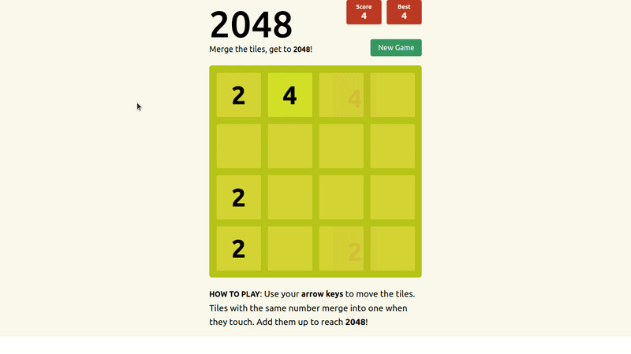

# 2048 Clone

[Live Demo](https://harunfr.github.io/2048/) :point_left:

Was popular game at year 2014. Revamped with minimal animation.



## Game Logic
* Game logic just calculates final appereance of cells.
* Doesn't use moving blocks, if would use animations would be possible.
* Is seperated from UI logic.

### Mechanism of Changing Cells State
* Numbers first joins together if they are same,
* Then moves to empty space in front of them.
* Finally, game puts number 2 or number 4 on empty blocks.

### UI Logic - Code
* Used too much wrapper with same name, I should have preffered code repetition over drying out and make it hard to read.
* uuid library is not always the best solution, array indexes can be used as key.
* Used tests to develop game logic, so implementing UI logic and knowing where to look when encountered an exception was easy.
----
#### Clone, Browse, Build, Run.
```markdown
		git clone git@github.com:harunfr/2048.git && cd 2048/ && code . && npm i && npm start
```


